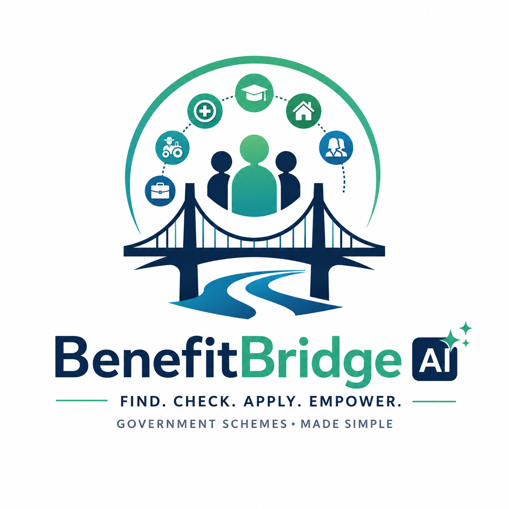

<p align="center">
  
</p>

<h1 align="center">BenefitBridge AI</h1>

<p align="center">
Helping people discover, understand, and apply for government schemes they are actually eligible for.
</p>

<p align="center">


</p>

<p align="center">

🌐 <b><a href="https://benefitbridge-ai.vercel.app">Live Demo</a></b> •
📚 <b><a href="https://benefitbridge-ai.onrender.com/docs">API Documentation</a></b> •
💻 <b><a href="https://github.com/raghav2606-ux/benefitbridge-ai">Source Code</a></b>

</p>

---

## 🚀 Project Snapshot

BenefitBridge AI is an AI-assisted platform that helps users quickly discover government schemes they are eligible for. Instead of searching through multiple government websites, users enter a few personal details and receive personalized recommendations, eligibility insights, required documents, and official application links in one place.

### ✨ Highlights

- 🎯 Personalized eligibility checking
- 📑 Government scheme recommendations
- 📄 Downloadable PDF eligibility reports
- 🔍 Smart search and category filtering
- ⚖️ Compare government schemes
- 📋 Required document guidance
- 🔗 Official government application links
- 📱 Fully responsive design
- ⚡ FastAPI backend with Next.js frontend

---

## About the Project

BenefitBridge AI is a web application that simplifies the process of finding government welfare schemes in India.

Instead of searching across multiple government websites and trying to understand complex eligibility rules, users can enter a few details about themselves and instantly receive personalized scheme recommendations.

For every recommended scheme, the application explains why the user qualifies, estimates the benefit, lists the required documents, and provides a direct link to the official application portal.

Our goal was to build something that reduces confusion and helps citizens spend less time searching and more time applying.

---

## Why We Built This

India has hundreds of central and state government schemes covering education, healthcare, agriculture, housing, employment, entrepreneurship, and financial assistance.

The biggest problem isn't that these schemes don't exist—it's that many people never discover the ones they qualify for.

We wanted to solve this by creating a single platform where users can answer a few simple questions and immediately see the schemes that are relevant to them.

---

## Features

- Personalized eligibility checking
- Smart government scheme recommendations
- Browse schemes by category
- Search schemes instantly
- Compare multiple schemes
- Estimated financial benefits
- Required document checklist
- Official government application links
- Downloadable PDF report
- Responsive interface for desktop and mobile

---

## Supported Categories

- Education
- Healthcare
- Agriculture
- Employment
- Housing
- Women Empowerment
- Startup & Entrepreneurship
- Senior Citizens
- Disability Support

---

## Tech Stack

### Frontend

- Next.js
- React
- TypeScript
- Tailwind CSS
- Framer Motion

### Backend

- FastAPI
- Python
- Pydantic

### Deployment

- Vercel
- Render

---

## Project Structure

```
BenefitBridge-AI
│
├── frontend/
│   ├── app/
│   ├── components/
│   ├── lib/
│   └── config/
│
├── backend/
│   ├── app/
│   ├── routes/
│   ├── services/
│   ├── builders/
│   ├── data/
│   └── main.py
│
└── README.md
```

---

## Running the Project

### Backend

```bash
cd backend

pip install -r requirements.txt

uvicorn main:app --reload
```

Backend runs at

```
http://127.0.0.1:8000
```

Swagger Documentation

```
http://127.0.0.1:8000/docs
```

---

### Frontend

```bash
cd frontend

npm install

npm run dev
```

Frontend runs at

```
http://localhost:3000
```

---

## Live Demo

Frontend

```
https://benefitbridge-ai.vercel.app
```

Backend

```
https://benefitbridge-ai.onrender.com
```

API Documentation

```
https://benefitbridge-ai.onrender.com/docs
```

---

## How It Works

1. User enters personal details.
2. Backend checks eligibility rules.
3. Matching schemes are identified.
4. Recommendations are ranked.
5. Benefits and required documents are displayed.
6. Users can compare schemes.
7. A PDF report can be downloaded.
8. Official application links are provided.

---

## Challenges We Faced

The biggest challenge wasn't writing the recommendation logic—it was deploying the complete application.

We had to solve issues related to frontend-backend communication, API configuration, CORS policies, environment variables, and production deployment.

Another challenge was organizing government scheme data in a way that makes adding new schemes straightforward without changing the backend logic.

---

## How We Used GPT-5.6 and Codex

GPT-5.6 acted as a development assistant throughout the project. It helped us review backend architecture, debug deployment issues, refine API design, improve the user experience, and explain implementation choices while we were building.

Codex helped accelerate development by assisting with coding tasks, reviewing implementations, and speeding up iteration. We used it to move from ideas to working features more efficiently while testing and validating the final application ourselves.

---

## Future Improvements

If we continue developing this project, we'd like to add:

- Automatic updates from official government sources
- State-specific schemes
- Multilingual support
- AI-powered question answering
- Document verification
- User accounts
- Application tracking
- Notifications for deadlines and newly launched schemes

---

## Team

OpenAI Build Week 2026

---

## License

This project was developed for educational and hackathon purposes.
